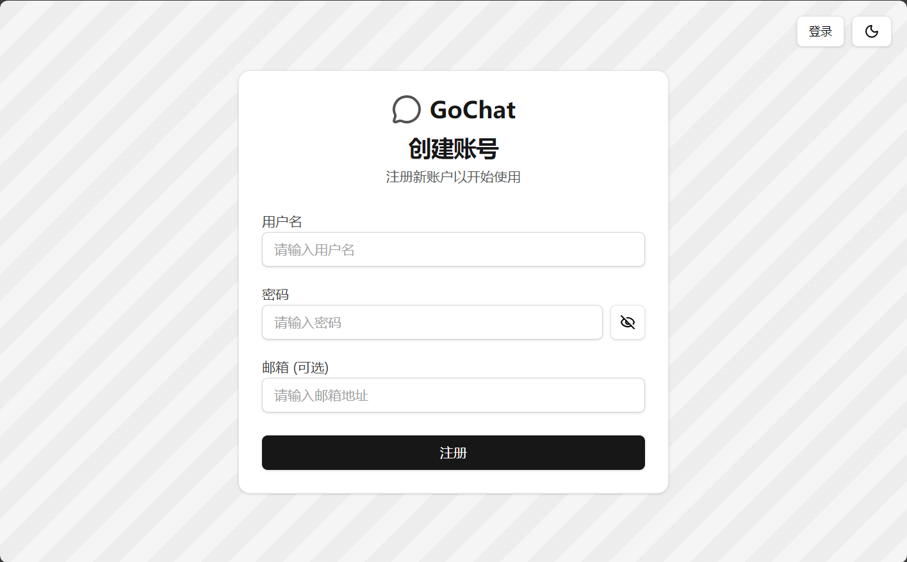
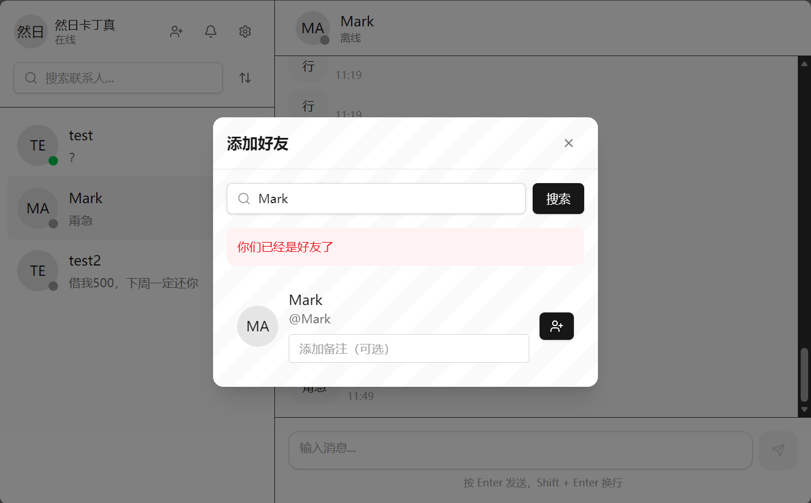
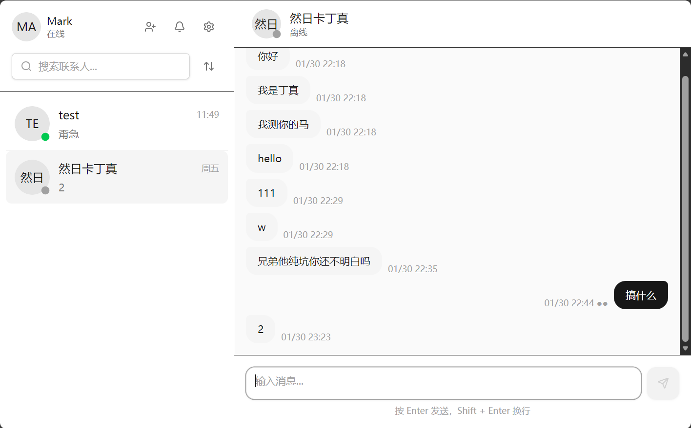

# GoChat 前端

基于 React + TypeScript + Vite + shadcn/ui 的实时即时通讯前端应用。

## 技术栈

- **前端框架**: React 19 + TypeScript
- **构建工具**: Vite
- **UI 组件**: [shadcn/ui](https://ui.shadcn.com/)（基于 Radix UI 和 Tailwind CSS）
- **状态管理**: React Hooks + Context
- **本地存储**: IndexedDB（消息缓存）
- **路由**: React Router
- **图标**: Lucide React

## 功能特性

- 用户认证（注册、登录）
- 好友列表管理（搜索、添加、查看申请）
- 实时消息收发（WebSocket）
- 消息历史记录
- 未读消息计数（持久化）
- 在线状态显示
- 深色/浅色主题切换
- 响应式布局

## 快速开始

### 环境要求

- Node.js 18+
- pnpm（推荐）或 npm

### 安装依赖

```bash
pnpm install
```

### 启动开发服务器

```bash
pnpm dev
```

应用将在 `http://localhost:5173` 启动。

### 构建生产版本

```bash
pnpm build
```

构建产物将输出到 `dist` 目录。

## 使用说明

### 1. 注册与登录

首次打开应用时，需要注册账号或登录现有账号。



### 2. 添加好友

- 点击侧边栏的「添加好友」按钮
- 输入好友的用户名进行搜索
- 发送好友申请



### 3. 聊天界面

- 点击左侧好友列表中的联系人开始聊天
- 底部输入框发送消息
- 未读消息会在好友列表显示红色角标



### 4. 处理好友申请

- 点击侧边栏的「铃铛」图标查看待处理申请
- 可以同意或拒绝好友申请


### 5. 消息列表

好友列表显示：
- 好友头像和在线状态
- 最后一条消息预览
- 消息时间
- 未读消息数量（红色角标）


### 6. 设置

- 点击侧边栏的「设置」图标
- 可以切换深色/浅色主题
- 退出登录


## 项目结构

```
src/
├── components/
│   ├── chat/                  # 聊天相关组件
│   │   ├── AddFriendDialog.tsx
│   │   ├── ChatInput.tsx
│   │   ├── ChatWindow.tsx
│   │   ├── ContactList.tsx
│   │   ├── FriendRequestsDialog.tsx
│   │   ├── ImageCropper.tsx
│   │   ├── MessageBubble.tsx
│   │   └── SettingsDialog.tsx
│   └── ui/                    # shadcn/ui 基础组件
│       ├── avatar.tsx
│       ├── button.tsx
│       ├── card.tsx
│       ├── dialog.tsx
│       ├── input.tsx
│       ├── label.tsx
│       ├── scroll-area.tsx
│       ├── separator.tsx
│       ├── textarea.tsx
│       └── resizable.tsx
├── lib/
│   ├── api.ts                 # API 调用封装
│   ├── chatCache.ts           # IndexedDB 消息缓存
│   ├── utils.ts               # 工具函数
│   └── websocket.ts           # WebSocket 客户端
├── pages/
│   ├── AuthPage.tsx           # 认证页面
│   └── ChatPage.tsx           # 主聊天页面
├── types/
│   └── index.ts               # TypeScript 类型定义
├── App.tsx
└── main.tsx
```

## API 接口

前端通过 `src/lib/api.ts` 封装了所有后端 API 调用。

### 核心 API 函数

| 函数 | 功能 |
|------|------|
| `register(username, password, email)` | 用户注册 |
| `login(username, password)` | 用户登录 |
| `searchUser(username)` | 搜索用户 |
| `sendFriendRequest(targetId, remark?)` | 发送好友申请 |
| `getFriendRequests(status?)` | 获取好友申请列表 |
| `handleFriendRequest(requestId, action)` | 处理好友申请 |
| `getFriendList()` | 获取好友列表（包含未读计数） |
| `markMessagesRead(targetId)` | 标记消息已读 |
| `getPendingRequestCount()` | 获取待处理申请数量 |

### WebSocket

`src/lib/websocket.ts` 封装了 WebSocket 连接和消息收发：

```typescript
// 创建连接
const client = new WebSocketClient(wsUrl)
await client.connect()

// 订阅消息
client.subscribe((message) => {
  console.log('收到消息:', message)
})

// 发送单聊消息
client.sendSingleMsg({
  target_id: 2,
  content: '你好',
})
```

## 本地开发配置

### 环境变量

创建 `.env` 文件：

```env
VITE_API_HOST=localhost:8080
```

### 主题配置

主题相关样式在 `tailwind.config.js` 中配置，支持深色/浅色模式切换。

## 依赖的主要开源组件

本项目使用以下开源组件：

- **shadcn/ui** - UI 组件库（MIT License）
- **Radix UI** - 无样式可访问组件（MIT License）
- **Tailwind CSS** - CSS 框架（MIT License）
- **Lucide React** - 图标库（ISC License）
- **clsx** - 条件类名拼接（MIT License）
- **tailwind-merge** - Tailwind 类名合并（MIT License）

## Cookbook

### 1. 添加新组件

使用 shadcn/ui 添加组件：

```bash
pnpm dlx shadcn@latest add button
```

### 2. 自定义主题

修改 `tailwind.config.js` 中的颜色配置：

```javascript
colors: {
  border: "hsl(var(--border))",
  input: "hsl(var(--input))",
  ring: "hsl(var(--ring))",
  // ...
}
```

### 3. 消息缓存机制

消息使用 IndexedDB 本地缓存：

```typescript
// 保存消息
await chatCache.saveMessage(message)

// 获取消息
const messages = await chatCache.getCachedMessages(targetId)

// 标记已读
await chatCache.markAllAsRead(targetId)
```

### 4. 添加新的 API 接口

在 `src/lib/api.ts` 中添加：

```typescript
export async function newApi(): Promise<ApiResponse> {
  const response = await fetch(`${API_BASE_URL}/new/endpoint`, {
    headers: { Authorization: `Bearer ${getToken()}` },
  })
  return response.json()
}
```

## 浏览器支持

- Chrome 90+
- Firefox 88+
- Safari 14+
- Edge 90+

## License

MIT

---

本项目使用 [shadcn/ui](https://ui.shadcn.com/) 开源组件库。

本项目开发过程中使用了 [Claude Code](https://claude.com/claude-code) 和 [Gemini](https://gemini.google.com/) 辅助编程。
