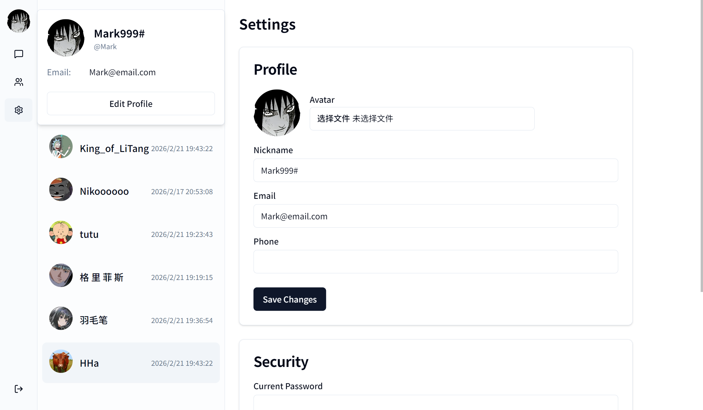
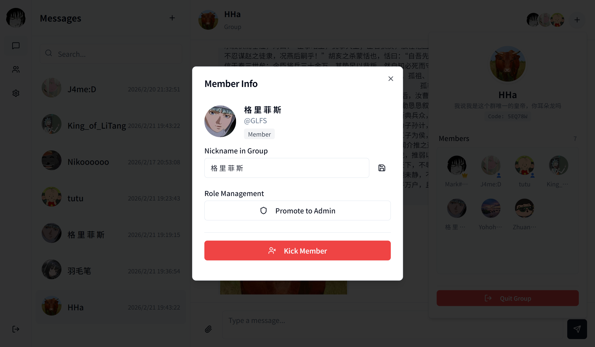

# Go Chat Web


Go Chat Web 是一个基于 Vue 3 和 Vite 构建的现代化 Web 聊天应用前端。它提供了流畅的用户体验和美观的界面，作为 [Go Chat](https://github.com/whosepen/go-chat) 后端的配套前端项目。

## ✨ 特性

- **实时通讯**：支持私聊和群聊功能。
- **现代化 UI**：使用 Tailwind CSS 和 Shadcn Vue 构建，界面简洁美观。
- **响应式设计**：适配多种屏幕尺寸。
- **状态管理**：使用 Pinia 进行高效的状态管理。
- **类型安全**：采用 TypeScript 开发，代码健壮。

## 📸 项目展示

### 用户信息


### 群组聊天


## 🛠️ 技术栈

本项目使用了以下开源技术和组件：

- **核心框架**: [Vue 3](https://vuejs.org/)
- **构建工具**: [Vite](https://vitejs.dev/)
- **编程语言**: [TypeScript](https://www.typescriptlang.org/)
- **样式库**: [Tailwind CSS](https://tailwindcss.com/)
- **UI 组件**: [Shadcn Vue](https://www.shadcn-vue.com/) (基于 [Radix Vue](https://www.radix-vue.com/))
- **状态管理**: [Pinia](https://pinia.vuejs.org/) (配合 [pinia-plugin-persistedstate](https://prazdevs.github.io/pinia-plugin-persistedstate/))
- **路由管理**: [Vue Router](https://router.vuejs.org/)
- **HTTP 客户端**: [Axios](https://axios-http.com/)
- **图标库**: [Lucide Vue Next](https://lucide.dev/)
- **工具库**: [VueUse](https://vueuse.org/), [date-fns](https://date-fns.org/), [clsx](https://github.com/lukeed/clsx), [tailwind-merge](https://github.com/dcastil/tailwind-merge)

## 🤖 AI 辅助开发

本项目在开发过程中使用了以下 AI 工具进行辅助：

- **Trae**: 强大的 AI 驱动 IDE，辅助代码生成、重构及问题排查。
- **Gemini**: 提供底层的代码逻辑推理和自然语言理解能力。

## 🚀 快速开始

### 前置要求

- Node.js (推荐 v18 或更高版本)
- npm 或 pnpm

### 安装步骤

1. 克隆仓库：

```bash
git clone https://github.com/your-username/go-chat-web.git
cd go-chat-web
```

2. 安装依赖：

```bash
npm install
# 或者
pnpm install
```

3. 启动开发服务器：

```bash
npm run dev
```

4. 构建生产版本：

```bash
npm run build
```

## 🔗 后端仓库

本项目需要配合后端服务运行，后端代码请参考：

- **GitHub**: [whosepen/go-chat](https://github.com/whosepen/go-chat)

## 📄 许可证

MIT
